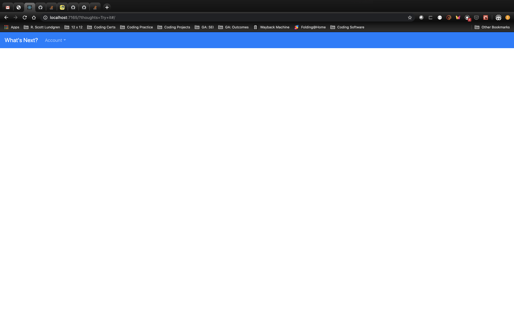
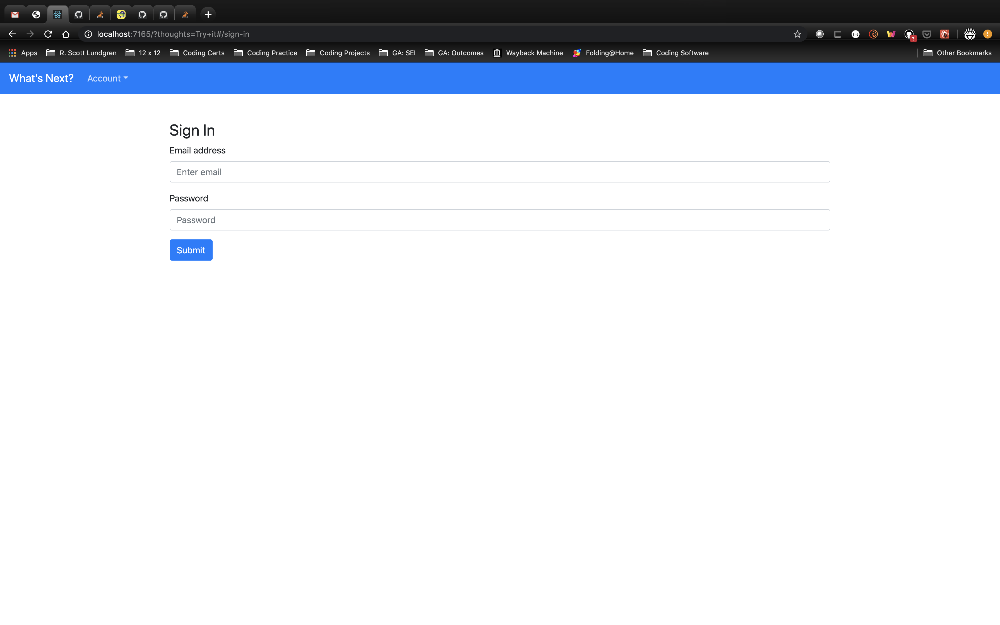
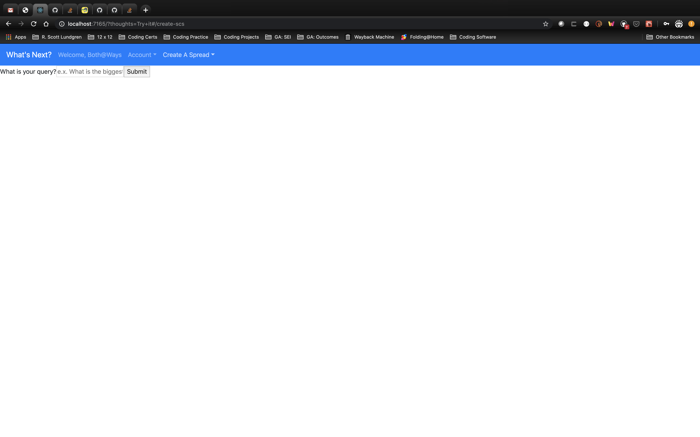
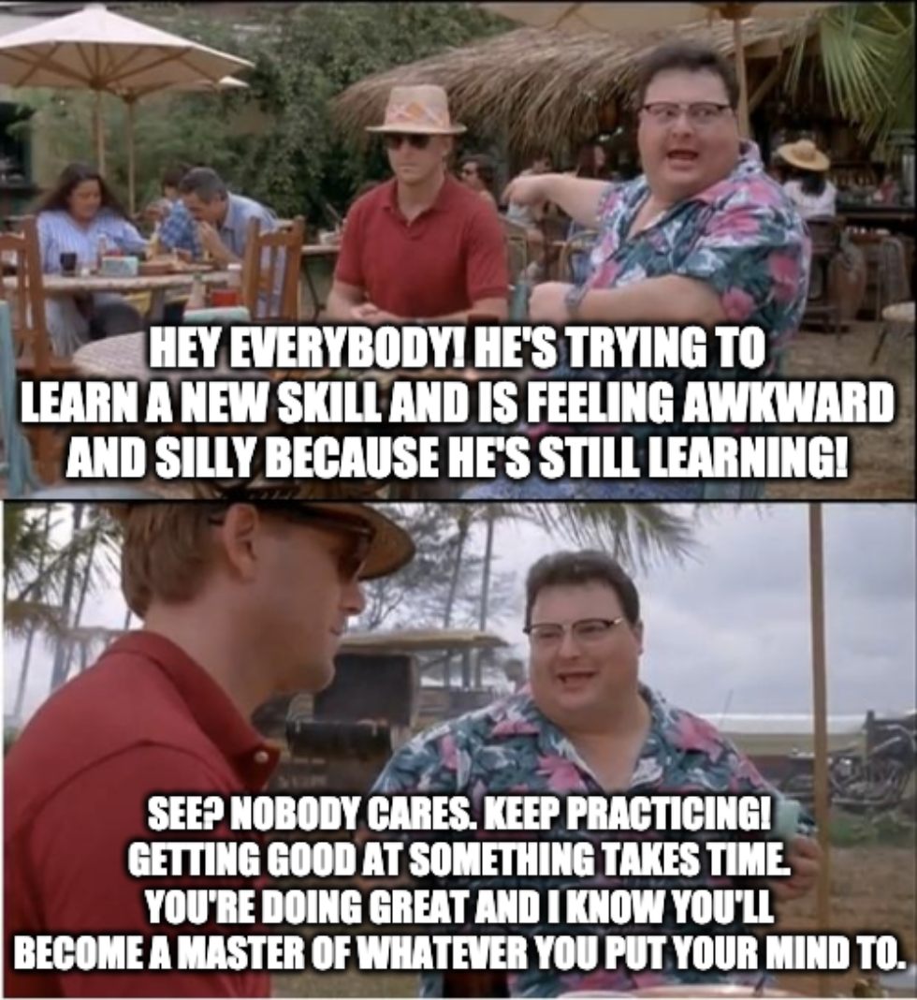

# What's Next - Client (v1)

## Description
"What's Next" is a single page Tarot application designed to serve as a resource for users who would like to have their questions answered by the cards. The name is derived from President Bartlet's famous line from 'The West Wing', "What's next?". The application has a pre-defined, uneditable deck of 78 tarot cards. The specific deck used for this v1 application is "The Vertigo Tarot" inspired by the "Sandman" comics. For v1, a user can create a "single card spread" to answer their question, which when typed into the form and submitted to the API, will generate a randomly selected card and, for that card, a randomly selected orientation (right-side up/upside down) which the user will then use to interpret the answer to the question they have posed by entering their thoughts into the text box field. The user will have the ability to see all readings, update a their thoughts and delete their thoughts on a specific reading - however they are not going to be able to delete the specific reading itself. This was a conscious decision based on the idea that, typically, a user will delete something because they do not like it, thus they might delete a reading because they do not like the answer they received. If this were an in-person reading, the astrologer would commonly say that just because a user/client doesn't like the reading doesn't make it any less valid. This is why you can only submit, update, and delete your interpretations of the reading.

## Relevant Links
Full-Stack: | Link To: | URL:
------------|----------|--------------------------------------------------------
Front-End   | Website  | https://rscottlundgren.github.io/whats-next-client/#/
------------|----------|--------------------------------------------------------
Front-End   | GitHub   | https://github.com/rscottlundgren/whats-next-client
------------|----------|--------------------------------------------------------
Back-End    | Website  | https://gentle-cliffs-56174.herokuapp.com/
------------|----------|--------------------------------------------------------
Back-End    | GitHub   | https://github.com/rscottlundgren/whats-next-api

## List of Technologies Used
- React template
- Axios
- Custom-Built API
- Express
- MongoDB/Mongoose
- JavaScript
- HTML
- CSS/SASS
- Postman
- Bootstrap
- Flexbox
- React

## Wireframes & ERD
- [Wireframe](https://i.imgur.com/tLssMXr.png)
- [ERD](https://i.imgur.com/6Vi6tx9.png)

## App v1 Images

## User Stories
- As an unregistered user, I would like to sign up with email and password.
- As a registered user, I would like to sign in with email and password.
- As a signed in user, I would like to change password.
- As a signed in user, I would like to sign out.
- As a signed in user, I would like to create a new reading to answer a question I posed to the application.
- As a signed in user, I would like to create and post my thoughts on the reading I received in response to my question.
- As a signed in user, I would like to update my thoughts on the reading I received in response to my question.
- As a signed in user, I would like to delete my thoughts on the reading I received in response to my question.
- As a signed in user, I would like to see all of the readings I have requested.

## Planning
Prior to the project (at around the time the second project had been assigned) I had given some thought to how I might create an app like this. Originally, the idea was inspired by a [digital deck of cards](https://deck.of.cards/). A later version concept would be to have a deck of cards that would have the same malleability as the website that inspired the original idea, allowing the user to perform any number of divinatory spreads. To start, however, I wanted to create a simple site that would allow for a single card spread to be performed, providing details, and an opportunity to update and delete thoughts at any point after the initial reading.

For those that are unfamiliar, each individual card has a relatively unique set of correspondences. Those correspondences also help to create the four minor arcana and the larger, major arcana. Each card also balances/plays off the correspondences off each other card that is placed down in the reading (upright (analog) or upside down (echo)) based off positioning. With this understanding in mind I knew that I would need to work with something that could provide a strict scaffold of data, but would also be malleable/fluid in its interactions with other data structures like itself - so I settled on using MongoDB/Express for the backend (a framework I'm developing a stronger understanding in, though that understanding is hard-won).

For the front end I knew that, eventually, I'd want a smooth and feature-rich UI. I also wanted more exposure to the React framework which inspired me to try working with the React Auth Template through GA instead of the Browser Template I had worked with for the prior three projects. This provided an added challenge - I've had an incredibly hard time grasping the React framework and it has been slow goings working with it.

In all, these three challenges proved to be a lot more of a combined hurdle than I anticipated. Despite having done some decent preparatory work, creating my ERDs and Wireframes, not having a sound enough grasp of React's principles proved to be an incredibly large obstacle. In addition to all of this, after initially structuring the data I discovered that I had made a mistake in formatting which resulted in me deleting the original database of 78 cards and having to create them all over again.

Throughout my experience I have relied heavily upon the expertise of my instructors, the assistance of my classmates, and various videos and online tutorials to provide me with a better understanding of React so I could move with greater alacrity through the creation process. While the process is still challenging, it has been incredibly rewarding - as each foundational principle is mastered it becomes easier to understand the next concept and, in addition, to troubleshoot those problems that I run at later points in the code.

## Journal & Challenges-of-Note
I didn't realize it, but I bit off much more than I could chew for a 4 day project for project 4. As previously mentioned, I gave myself 3 challenges that seemed manageable but, in retrospect, should've been further scoped down:

1. I had a week of exposure to React and made the decision to use that framework as the basis for my Front-End,
1. I had more exposure to MongoDB/Mongoose/Express but still felt a little shaky on it, so I decided that practice might be nice so I used that for my Back End, and
1. I wanted to create an app that could be used to read Tarot cards (each Tarot card has several correspondences which would mean a complicated data set)

I discovered my error very quickly when I realized exactly how much data entry alone there was to do. Working in Postman was incredibly helpful in that regard as it allowed me to streamline that process, but even still that took up almost a full 24 hours. On top of this, I was working with two frameworks that I had minimal expertise in which turned out to be quite the trial by fire.

On the back end, the biggest challenge was structuring the dataset and coming to realize that I wasn't working with just a user and a resource (card spreads), I was working with another resource as well (Tarot deck). During the process I ended up restructuring what was already a complicated series of correspondences which became necessary after realizing that, without that change, pulling the data into React props would be considerably more challenging. In addition, having to figure out an appropriate scaffold for the singleCardSpread model that would allow me the v1 features I was looking for also proved to be a challenge, however MongoDB/Mongoose/Express are extraordinarily malleable so once I had built the idea out on paper, it was relatively easy to execute.

On the front end, React proved to be a challenge as well. We had about a week of "formal" exposure to React which was enough to introduce us to all of the core concepts in the framework and some relatively new additions (Hey there, Hooks & Stateless Components!) to the framework as well. During the introduction I found the idea behind React to be easy to grasp - everything is modularized so that you have an application where you have components and functions that (ideally) should only be doing one thing and you import those around your program as you need them as necessary. That's where my understanding stopped as implementing such a framework can be hard to follow (which, to me, it was hard to follow to the nth degree). It was difficult to conceptualize where the things I knew I needed should go and, further, the idea of props and passing them (and state and holding that) proved to be (almost) insurmountable. Thankfully, I have a really awesome cohort who are all incredibly supportive of one another so we all were able to ask each other for assistance - both during the first submission and the resubmission.

Overall, I really enjoyed the challenge that working on this project brought. As I near the end of resubmission I've already started tooling around with ideas on how, exactly, I can "reset the clock" on the project so I can better solidify the ideas and concepts of React so I may become more adept at their use. It was also incredibly educational as there were multiple times where I got down on myself and embarrassed about how slowly I was picking up this new framework. Eventually I was able to let that go and have patience with myself and just move through the process - but getting to that point of serenity was a long slog.

Recently a friend of mine posted the meme below to LinkedIn and I liked it so much that I took it. When I began the process of working on the "retooling" of the site I'll be keeping this image first and foremost in my mind as I continue my work and run into the next frustrating concept/bug that I don't understand. With enough time, everything becomes easier.

## Unsolved Problems
* [ ] Styling & Formatting: I'm still getting the hang of styling/formatting in React.js - this will come with time but for now v1 is an incredibly rough sketch of what is needed to pass MVP.
* [ ] Deck Iteration: Presently when the back end is collecting the correctly defined index of the cards array, it iterates through the entire array until it reaches the selected card. This seems like an unnecessary waste.
* [ ] Shuffle: I'd like to build in a shuffle component that allows the user to shuffle the deck a predetermined (by them) number of times before the card is selected.
* [ ] Cut: I'd like to build in a "cut" component that would allow a user to "cut" the deck at a certain location in the deck array, then combine the array together before shuffling one last time.

## Future Goals
* [ ] __History/Context:__ Provide greater generalized knowledge around the Tarot, universal, and specific to the major, minor arcana, in addition to paying attention to the court cards of the four suits.
* [ ] __Flexible Board (deck.of.cards):__ Create and finalize a UI similar to that utilized by "deck.of.cards".
* [ ] __Tarot Memorization/Training:__ Provide an option for users to train on learning tarot card correspondences.
* [ ] __Spread Options:__ Add several more "spread" options to choose from, including but not limited to the following:
    * [ ] Three Card
    * [ ] Celtic Cross
    * [ ] Simple Five Card Spread
        * [ ] Five Card Relationship Cross
        * [ ] Five Card Find Love Cross
    * [ ] Seven Day Spread
    * [ ] Mandala
    * [ ] Full Moon
    * [ ] Tree of Life
* [ ] __Preferred Decks for Users:__ Adding a "Preferred" or "Favorite" deck for a user so they aren't restricted to using one deck that they may not like or, alternatively, having multiple decks where they specify a certain deck for a specific reading.
* [ ] __Additional Deck Images:__ At some point I would like to add future decks/images to the application including, but not limited to, the following:
    * [ ] Rider-Waite
    * [ ] Tattoo
    * [ ] Mythic
    * [ ] Dreaming Way
    * [ ] Barbara Walker
    * [ ] Manzel's Tarot II
    * [ ] Next World
    * [ ] Ellis
    * [ ] Marseille
    * [ ] Illuminated
    * [ ] Wild Unknown
    * [ ] Neon Moon
    * [ ] Mystic Mondays
    * [ ] Justice League

## Special Thanks
A special thank you goes out to the following people (in no particular, yet alphabetical by first name, order):

- Alex Beers
- Angelique Marquina
- Ben Jenkins
- Brandon DePalmaFarr
- Brian Dorgan
- Chris Kennelly
- Dan Powers
- Eron Salling
- Esat Ozen
- Frank Luis-Ravelo
- Hannah See
- Jeffrey Springwater
- Jennifer Payano
- John Lucker
- Kane Two Feathers
- Ladybug Dorgan-Lundgren
- Liz Cramer Fox
- Matt Siperko
- Megan Tsai
- Mike Finneran
- Mike Tripp
- Murat Alayurt
- Naida Rosenberger
- Nick Solie
- Randy Dorgan-Lundgren
- Rick Wilcoxen
- Ross Northrop
- Ryry Tillman-French
- Tal Aharon
- Thanh "T" Nguyen
- Trey Hilson
- Youri Francois
